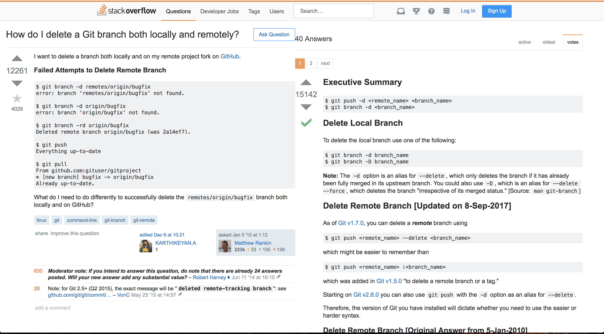

<h1 align="center"> Stack OnTop </h1>

<h3 align="center">
  Automatically Place the Accepted Stack Overflow Question at the Top
</h3>

# Installation

### This Chrome extension is not currently available in the Chrome Web store. 

#### To install follow the steps below: 

1. Clone or download the project from GitHub
2. Open Google Chrome and navigate to [chrome://extensions/](chrome://extensions/)
3. Check the "Developer Mode" checkbox
4. Click `Load Unpacked` Extension button
5. Select the `stack-ontop` directory you downloaded from step 1
